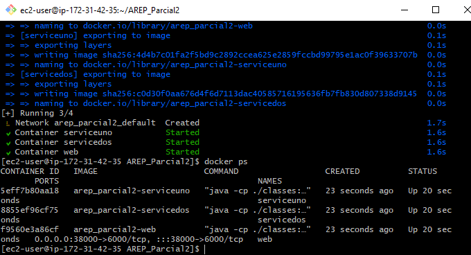
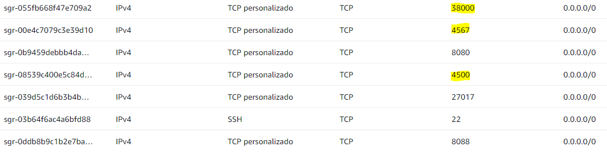

# AREP_Parcial2
## SERGIO DANIEL LOPEZ VARGAS
### Instrucciones de Ejecución
* Clone el repositorio desde GitHub:

```
git clone https://github.com/sergiolopezzl/AREP_Parcial2.git
```

* Navegue al directorio del proyecto: 

```
cd AREP_Parcial2
```

* Compile el proyecto y descargue las dependencias con Maven: 

```
mvn clean package
```

* Ejecute el `MathService` utilizando el siguiente comando en las dos instancias EC2: 

```
mvn exec:java '-Dexec.mainClass=org.example.MathService'
```
* Ejecute el `ServiceProxy` utilizando el siguiente comando en la ultima instacia que sera el servidor central:
```
mvn exec:java '-Dexec.mainClass=org.example.ServiceProxy'
```

* Para su funcionamiento `round-robin`, `MathService` tiene el puerto *4500* y el `ServiceProxy` tiene 
*4567*, este necesita el `MathService` para poder calcular lo solicitado. Debe tener los dos ejecutandose al tiempo

* Acceda:
  * Local: http://localhost:4567/
  * AWS: http://ec2-3-85-40-121.compute-1.amazonaws.com:4567/
* Con Docker
  * Local Docker: http://localhost:38000/
  * AWS Docker: http://ec2-18-234-70-136.compute-1.amazonaws.com:38000/

  
    
## Pruebas
### Video prueba del funcionamiento `round-robin` en aws con 3 EC2 una el `ServiceProxy` y las otras dos los servicios `MathService`

[](https://www.youtube.com/watch?v=acmVBZ462HA)


### Prueba Local


### Prueba AWS EC2

* Podemos ver como se evidencia en el video que cuando un `MathService` de alguna EC2 cae no sirve ese servicio en el `ServiceProxy`


* Aca esta su configuracion


### Pruebas Docker

* Prueba AWS EC2 con maquinas virtuales Docker 2 servicios 1 web






* Prueba local con maquinas virtuales Docker 2 servicios 1 web


