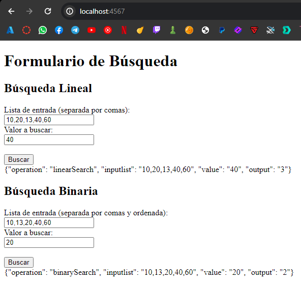

# AREP_Parcial2
## SERGIO DANIEL LOPEZ VARGAS
### Instrucciones de Ejecución
* Clone el repositorio desde GitHub:

```
git clone https://github.com/sergiolopezzl/AREP_Parcial2.git
```

* Navegue al directorio del proyecto: 

```
cd AREP_Parcial2
```

* Compile el proyecto y descargue las dependencias con Maven: 

```
mvn clean package
```

* Ejecute el `MathService` utilizando el siguiente comando: 

```
mvn exec:java '-Dexec.mainClass=org.example.MathService'
```
* Ejecute el `ServiceProxy` utilizando el siguiente comando:
```
mvn exec:java '-Dexec.mainClass=org.example.ServiceProxy'
```

* Para su funcionamiento `round-robin`, `MathService` tiene el puerto *4500* y el `ServiceProxy` tiene 
*4567*, este necesita el `MathService` para poder calcular lo solicitado. Debe tener los dos ejecutandose al tiempo

* Acceda a Local: http://localhost:4567/
  * Local: http://localhost:4567/
  * AWS: http://ec2-18-234-70-136.compute-1.amazonaws.com:4567/
    
### Pruebas
* Prueba Local



* Prueba local con maquinas virtuales Docker 2 servicios 1 web


* Prueba AWS EC2
* 


* Prueba AWS EC2 con maquinas virtuales Docker 2 servicios 1 web
* 


